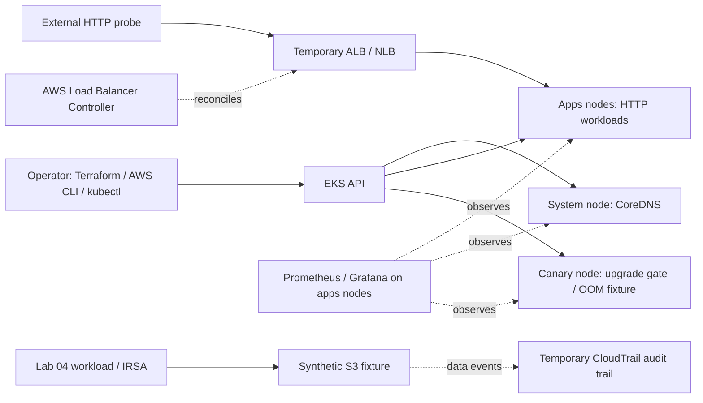

# EKS production operations lab

Five hands-on incident exercises on AWS EKS: staged upgrades, blocked drains,
OOM triage, workload IAM remediation, and ingress failures. Each exercise follows
the same discipline: establish a baseline, introduce a bounded fault, collect
evidence, diagnose it, verify recovery, and clean up owned resources.

This is a disposable learning and operations portfolio project. It demonstrates
production-relevant practices on deliberately constrained infrastructure; it is
not a production-ready platform or an availability guarantee.

[Lab results](#labs-and-observed-results) · [Evidence index](evidence/README.md) ·
[Access setup](docs/access.md) · [Teardown](docs/teardown.md) ·
[Contributing](CONTRIBUTING.md)

## Labs and observed results

Executed September 8–9, 2026. Results describe those runs, not the current health
of an AWS environment. Failed samples and measurement limits remain visible.

| Lab | Operational question | Observed result | Evidence |
| --- | --- | --- | --- |
| [01 · Cluster upgrade](labs/01-cluster-upgrade.md) | Can control plane and workers advance independently under HTTP traffic? | Upgrade 1.35 → 1.36 completed; **9 HTTP 502s / 26,611 requests**. Zero-failure objective failed. | [Upgrade report](evidence/cluster-upgrade/summary.md) |
| [01 · Follow-up](evidence/cluster-upgrade/remediation-20260908T210043Z/summary.md) | Do readiness gates and spare capacity support a controlled drain? | **4,030 requests, zero observed failures** in a separate drain; the original upgrade was not repeated. | [Remediation report](evidence/cluster-upgrade/remediation-20260908T210043Z/summary.md) |
| [02 · Blocked drain](labs/02-node-drain-failure.md) | Why does a PodDisruptionBudget reject eviction? | One replica blocked eviction; two healthy replicas restored the budget. Selected-pod drain, not full-node evacuation. | [Drain report](evidence/node-drain/summary.md) |
| [03 · OOM triage](labs/03-oom-killed-triage.md) | What distinguishes container memory exhaustion from node pressure? | `OOMKilled` / exit 137, memory samples and restart evidence captured; allocator contained. | [OOM report](evidence/oom-triage/summary.md) |
| [04 · IRSA permissions](labs/04-irsa-breach.md) | Can excessive workload permissions be narrowed without losing intended access? | Synthetic private read reproduced; least privilege retained public reads and denied private reads/writes, with CloudTrail evidence. | [IAM report](evidence/irsa-breach/summary.md) |
| [05 · Ingress outage](labs/05-ingress-outage.md) | Is the failure a wrong backend port or a policy drop? | Wrong port produced 502; policy produced 504. Both recovered to HTTP 200; AWS deletion verified before namespace cleanup. | [Ingress report](evidence/ingress-outage/summary.md) |

## Architecture



Terraform owns the VPC, cluster, managed node groups, managed add-ons, monitoring,
and controller installation. The controller owns load balancers requested by
Kubernetes objects. Lab 04 adds opt-in Terraform fixtures and a separately
operated audit trail. That ownership split determines cleanup order.

New-cluster defaults use two AZs, one NAT gateway and four Bottlerocket workers:
apps=2 × m6i.large, system=1 × t3.small, canary=1 × t3.small. Apps host the shared
HTTP demo, controller and monitoring; taints reserve system and canary nodes.
The source starts at Kubernetes 1.35 to support Lab 01; the completed run reached
1.36. Version defaults are lab inputs, not a claim of the latest supported release.

Private EKS endpoint access stays enabled. Public access requires an explicit
operator CIDR allowlist. Nodes use private subnets and NAT for outbound access.
The single NAT, single system node and single ephemeral Prometheus replica are
intentional cost/availability tradeoffs. Alertmanager is disabled. See the
[dated infrastructure review](docs/infrastructure-review.md) for their rationale.

## Start here

For a project review, start with the lab table and evidence summaries. For a
new deployment, follow this order; do not use a fresh clone to manage an existing
cluster whose authoritative local state lives elsewhere.

1. Read [state and repository safety](#state-and-repository-safety) and
   [ordered teardown](docs/teardown.md). EKS, EC2, NAT, storage and temporary load
   balancers incur charges while deployed; worker surge can exceed steady-state capacity.
2. Install Terraform within the declared `>= 1.6.0, < 2.0.0` range, AWS CLI v2,
   kubectl compatible with the chosen cluster, Helm, Bash, jq, curl and Python 3.9+.
   Ruby and kubeconform are used for local/CI validation. Individual runbooks list
   additional tools, such as kubent for the upgrade exercise.
3. Follow [plan preparation](terraform/PLAN_READINESS.md). Customize the sample
   only for a new environment; preserve existing tfvars, AZs, capacity, encryption
   choices and version pins when operating a deployed one.
4. Establish the intended AWS identity and API path using [access setup](docs/access.md).
   Review the actual plan and back up state before any approved apply.
5. Verify the [HTTP workload](kubernetes/apps/README.md),
   [load balancer controller](docs/load-balancer-controller.md), and monitoring.
   Complete [native NetworkPolicy preflight](docs/lab05-network-policy.md) before Lab 05.
6. Execute one lab at a time. Save raw captures under ignored `.local/`, verify
   recovery, and complete that lab's cleanup before starting another.

## Validate without deployment

From the repository root, after installing the validation prerequisites:

```bash
terraform -chdir=terraform init -backend=false -input=false -lockfile=readonly
make validate
```

Initialization downloads pinned dependencies and writes the local provider cache;
it does not create infrastructure. `make validate` checks Terraform format/schema,
YAML syntax, shell/Python syntax, local Markdown link destinations and structured
evidence. It neither plans against AWS nor applies resources.

For Kubernetes schema checks, install kubeconform v0.6.7 and run:

```bash
make validate-schemas
```

The schema target uses Kubernetes 1.35.0, matching the source fixture baseline.
It does not certify full 1.36 compatibility, CRD behavior, IAM permissions or
runtime availability. The [Validate workflow](.github/workflows/validate.yml)
runs these checks in GitHub Actions. Check its run results separately; a local
validation pass is not a claim that remote CI passed.

`make help` lists operation targets. `make up`, `make deploy-apps` and the Lab
02–04 triggers make changes; they are convenience commands, not substitutes for
the runbooks. `make lab01-trigger` and `make lab05-trigger` only show guidance.

## State and repository safety

- Preserve `terraform/terraform.tfstate` and `terraform/terraform.tfstate.backup`.
  If named workspaces were used, preserve `terraform/terraform.tfstate.d/` too
  and record the selected workspace. With a custom state path, preserve that
  path instead. A fresh clone does **not** recover deployed infrastructure.
- Before changes or teardown, and after **every successful, failed, or interrupted
  apply/destroy**, wait for Terraform to exit and copy the latest state, backups,
  and any `errored.tfstate` to access-restricted, encrypted storage outside this
  checkout. Keep dated versions and verify backups can be read. Preserve the exact
  configuration revision, input files, workspace, region and operator identity
  with the recovery record. Store credentials separately using your credential
  manager. Do not overwrite current state with an older backup to retry a failure.
- State and saved plans can contain secrets. `.gitignore` excludes them, real
  tfvars, credentials, caches and `.local/` raw artifacts. Use `*.tfplan` for saved
  plans or put arbitrary filenames under `.local/`. Commit only sanitized evidence
  to `evidence/`; inspect its contents before staging. Keep secrets out of tracked
  YAML and template files too. Never use `git clean -fdx` or delete the working
  directory while infrastructure remains; ignored state is still essential.
- Keep `terraform/.terraform.lock.hcl` in Git: it records provider selections and
  checksums, **not** live state. `terraform -chdir=terraform init` generates it when
  absent. Review and commit it; do not hand-write hashes or use `init -upgrade`
  during recovery. `.terraform/` is a disposable cache, but record the workspace
  before removing it. Provider constraints remain in `providers.tf`.
- `.gitignore` does not untrack previously committed files. In a Git checkout,
  inspect `git ls-files -ci --exclude-standard` and staged changes before pushing.
  If sensitive files are tracked, back them up securely before removing only their
  index entries with `git rm --cached -- <path>`. Rotate exposed credentials and
  arrange history cleanup if necessary; ignoring them does not erase history.

The [Terraform state documentation](https://developer.hashicorp.com/terraform/language/state)
and [dependency lock documentation](https://developer.hashicorp.com/terraform/language/files/dependency-lock)
describe these separate files. A remote backend is not needed for this single
operator workflow; shared operation would require a separate state design review.

## Cleanup and current evidence boundary

Lab cleanup retains the shared cluster, workers, HTTP demo, controller and
monitoring. The final Lab 05 capture on September 9 recorded four Ready nodes,
apps min/max/desired 2/2/2, demo/controller 2/2, 25/25 Prometheus targets healthy,
and a clean Terraform plan. This is a dated observation, not a live status badge.

To stop the environment's ongoing charges, follow [full teardown](docs/teardown.md):
remove Kubernetes entry points while controllers still work, verify AWS deletion,
then perform the reviewed Terraform destroy and residual-resource checks.
`make down` runs the read-only load-balancer gate before Terraform destroy; it
does not perform the prerequisite Kubernetes or namespace cleanup for you.

## Repository map

| Path | Purpose |
| --- | --- |
| [terraform/](terraform/) | Infrastructure, chart values, provider lockfile and example inputs |
| [kubernetes/](kubernetes/) | Shared HTTP workload, optional routes and intentional fault fixtures |
| [labs/](labs/) | Staged execution, diagnosis, remediation and cleanup runbooks |
| [evidence/](evidence/README.md) | Observed results, limitations and capture provenance |
| [docs/](docs/) | Access, controller/CNI setup, architecture rationale and teardown |
| [scripts/](scripts/) | Validation, observation and load-balancer cleanup checks |

No license has been selected for redistribution. Third-party dependencies retain
their own licenses; version/source references are in the Terraform files, lockfile,
chart declarations and linked upstream documentation.
